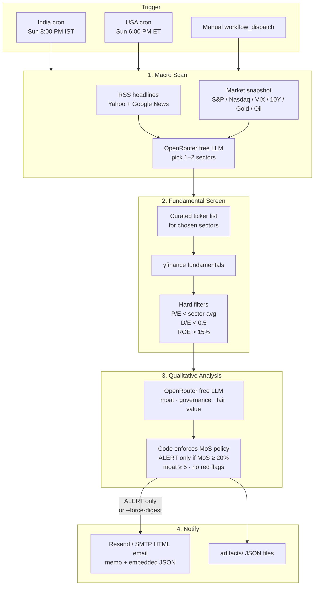
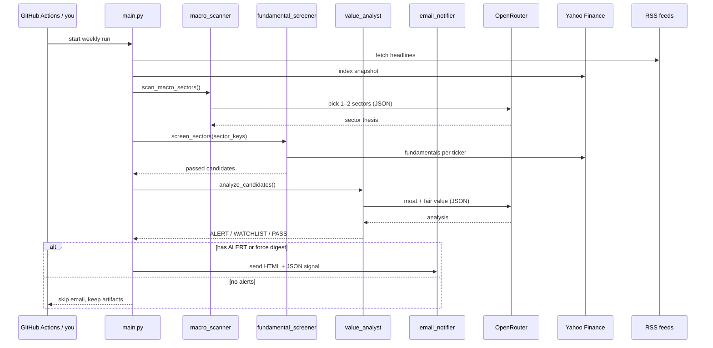

# Value Investing Alert System — Architecture

## System overview



## Step-by-step: what actually runs

### Step 0 — Start (`main.py`)
- Loads `.env` (OpenRouter key, Resend/SMTP, thresholds).
- Creates a unique `run_id` and an `artifacts/<run_id>/` folder.
- Runs the four stages below in order. Any hard failure stops the pipeline.

### Step 1 — Macro scan (`macro_scanner.py`)
**Goal:** Find 1–2 sectors that look structurally attractive over **12–36 months** (not day trades).

1. Pulls headlines from free RSS feeds (see [News sources](#news-sources--criteria) below).
2. Pulls a small market snapshot via Yahoo Finance: S&P 500, Nasdaq, Dow, VIX, US 10Y yield, gold, crude.
3. Sends that context to an OpenRouter free model with a strict JSON prompt.
4. Model must choose `sector_key` values **only from the curated list** in `config/sector_universe.py` (e.g. `semiconductors`, `india_growth`, `healthcare_biotech`).
5. Output is validated and mapped onto that universe. Max **2** sectors.

**Important:** This step does **not** pick stocks. It only picks sectors.

### Step 2 — Fundamental screen (`fundamental_screener.py`)
**Goal:** Cheap + strong balance sheet + high profitability, using math only (no LLM).

1. Loads the fixed ticker list for each selected sector from `sector_universe.py`.
2. For each ticker, fetches fundamentals with `yfinance`.
3. Computes sector average trailing P/E from peers that have a valid P/E.
4. Keeps a stock only if **all** pass:
   | Rule | Default |
   |---|---|
   | Trailing P/E | **&lt;** sector peer average |
   | Debt-to-Equity | **&lt;** 0.5 |
   | ROE | **&gt;** 15% |
5. Missing P/E, D/E, or ROE → stock is **rejected** (fail closed).
6. Survivors are sorted (cheapest P/E first) and capped (default 5 sent to the analyst).

### Step 3 — Value analyst (`value_analyst.py`)
**Goal:** Qualitative judgment + conservative fair value.

1. For each survivor, sends fundamentals + sector thesis to an OpenRouter free model.
2. Model returns JSON: moat score, management red flags, fair value, investment memo.
3. Code **recomputes** Margin of Safety:
   \[
   \text{MoS \%} = \frac{\text{fair value} - \text{price}}{\text{fair value}} \times 100
   \]
4. Code (not the model alone) decides recommendation:
   - **ALERT** — MoS ≥ 20%, moat ≥ 5, no severe red flags
   - **WATCHLIST** — interesting but not cheap enough / more uncertainty
   - **PASS** — weak moat, flags, or no discount

### Step 4 — Email (`email_notifier.py`)
- **Default:** email only if there is at least one **ALERT**.
- **Digest mode** (`--force-digest` / `DIGEST_WHEN_EMPTY=true`): email even with zero alerts.
- Email contains:
  1. Human-readable investment memo
  2. Embedded `<script type="application/json" id="value-signal">` for Phase 2 parsing
- Artifacts are also written under `artifacts/` for debugging.

### OpenRouter fallback (`llm/openrouter_client.py`)
If a free model hits **429**, **5xx**, timeout, or empty response, the client rotates to the next model in `OPENROUTER_MODELS`.

---

## Sequence (runtime)



---

## Will it only pick US stocks?

**No — you choose the market on each run.**

```bash
python main.py --market USA
python main.py --market India
# also works:
python main.py India
```

| Flag | Universe | News / indexes |
|---|---|---|
| `--market USA` | US-listed tickers in `USA_SECTOR_UNIVERSE` | US Google News + S&P/Nasdaq/VIX |
| `--market India` | NSE `.NS` tickers in `INDIA_SECTOR_UNIVERSE` | India Google News + Nifty/Sensex/Bank Nifty |

The LLM can only pick sector keys from that market’s list; stocks come from the hard-coded map in `config/sector_universe.py`.

Scheduled GitHub Actions:

| Workflow | Local time | UTC cron | Market |
|---|---|---|---|
| `weekly_india_scan.yml` | Sunday 8:00 PM IST | `30 14 * * 0` | India |
| `weekly_usa_scan.yml` | Sunday 6:00 PM ET | `0 23 * * 0` | USA |

Manual runs (`weekly_value_scan.yml`) let you pick `USA`, `India`, or `both`.

---

## News sources & criteria

### Feeds used today

Defined in `macro_scanner.py` and **scoped by market**:

**USA**

| Source | Criteria |
|---|---|
| Yahoo top stories | Market headlines |
| Google Business US | economy / Fed / inflation / policy · last 7d · `gl=US` |
| Google Markets US | stock market / sector outlook / earnings · last 7d · `gl=US` |

**India**

| Source | Criteria |
|---|---|
| Google India Economy | India economy / RBI / inflation / Budget / policy · last 7d · `gl=IN` |
| Google India Markets | Nifty / Sensex / India stock market · last 7d · `gl=IN` |
| Google India Business | infrastructure / manufacturing / banks / IT · last 7d · `gl=IN` |

### Selection rules (before the LLM)

1. Take up to **12** items per feed.
2. Keep items with a non-empty title.
3. **Deduplicate** by title.
4. Pass ~40 headlines + market index snapshot to the LLM.
5. There is **no** separate NLP classifier — the LLM does that judgment.

So: **`--market India` uses India-localized news**; **`--market USA` uses US-localized news**. They are not mixed in a single run.

---

## What it deliberately ignores

- Day trading / swing trading
- Technical indicators (RSI, EMA, MACD, chart patterns)
- Databases (Phase 1 emails JSON only; no Supabase yet)
- Invented tickers outside `sector_universe.py`

---

## File map

| File | Role |
|---|---|
| `main.py` | Orchestrates the full run |
| `macro_scanner.py` | News + indexes → sector thesis |
| `fundamental_screener.py` | Hard P/E, D/E, ROE filters |
| `value_analyst.py` | Moat, fair value, MoS |
| `email_notifier.py` | HTML + embedded JSON email |
| `config/sector_universe.py` | Allowed sectors & tickers |
| `llm/openrouter_client.py` | Free-model fallback |
| `.github/workflows/weekly_india_scan.yml` | India weekly cron (IST) |
| `.github/workflows/weekly_usa_scan.yml` | USA weekly cron (ET) |
| `.github/workflows/weekly_value_scan.yml` | Manual USA/India/both |
| `.github/workflows/value_scan_reusable.yml` | Shared scan job |
